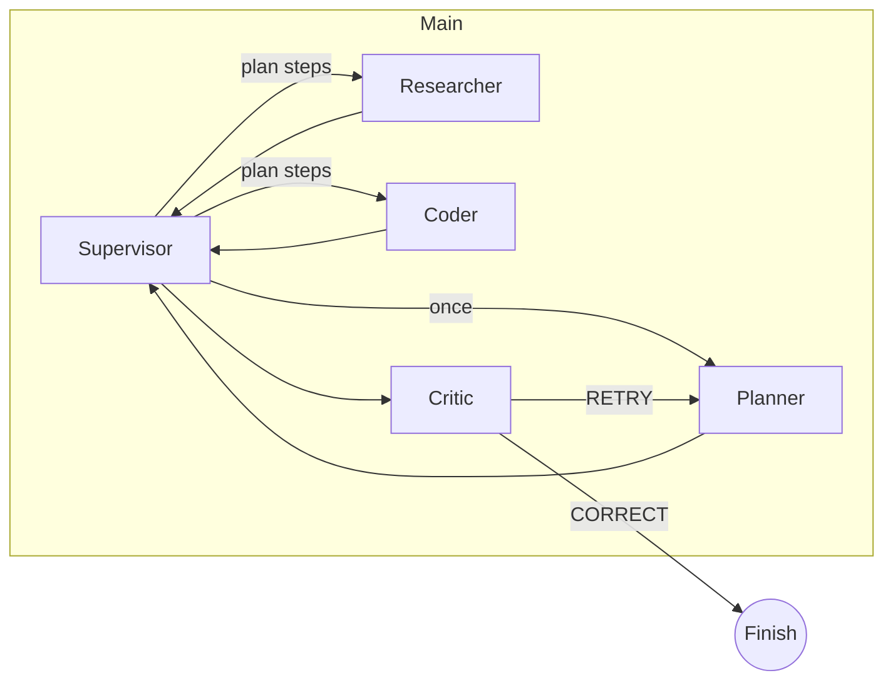

## GAIA Supervisor – Multi‑Agent Toolkit for the GAIA Benchmark

A modular Supervisor architecture built with **LangGraph** and **LangChain**.
It routes a user request through a *Planner → Worker loop → Critic* pipeline, persisting context via LangGraph checkpointers so every worker sees the latest state. Two lightweight tools—web search and Python execution—keep runtime costs low, while the design lets you add new workers in a few lines.

---

## ✨  Key Features

* **Supervisor routing** powered by an LLM that decides which agent acts next ([LangChain AI][1])
* **Planner node** drafts a step‑by‑step plan before any tool call, reducing token waste
* **Researcher** (TavilySearchResults) and **Coder** (PythonREPLTool) workers handle search & code ([Introduction | 🦜️🔗 LangChain][2], [Introduction | 🦜️🔗 LangChain][3])
* **Critic node** verifies the final answer and triggers automatic retries when needed
* **State checkpoints** provide memory, fault‑tolerance, and replay via LangGraph's persistence layer ([LangChain AI][4])
* **Plug‑and‑play workers**: add SQL, browser, or custom tools by extending the graph
* Compatible with OpenAI, Gemini, Claude, or any chat‑model supported by LangChain ([LangChain AI][5])
* Zero‑docker local development thanks to the LangGraph CLI "in‑memory" server ([LangChain AI][5])

---

## 🏗  Architecture



*Every node shares a single graph state that includes the conversation history + a `context` dictionary. Checkpointers persist this state between retries or restarts.* ([LangChain AI][4])

---

## 🚀  Quickstart (Windows 11, Python 3.12, **uv** + pyenv‑win)

### 1. Prerequisites

| Tool              | Purpose                                 | Docs                |
| ----------------- | --------------------------------------- | ------------------- |
| **pyenv‑win**     | Manage multiple Python versions         |  ([GitHub][6])      |
| **uv**            | Ultra‑fast `pip` + virtual‑env manager  |  ([Astral Docs][7]) |
| **LangGraph CLI** | Local API server + templates            |  ([PyPI][8])        |
| **Git**           | Clone the repository                    |                     |

### 2. Clone & set Python

```powershell
git clone https://github.com/<your‑org>/gaia‑supervisor.git
cd gaia‑supervisor

pyenv install 3.12.2
pyenv local 3.12.2
```

### 3. Create env & install deps

```powershell
# install uv once
irm https://astral.sh/uv/install.ps1 | iex    # PowerShell script

uv venv .venv
.\.venv\Scripts\Activate.ps1

uv pip sync          # reads uv.lock
uv pip install -e .  # editable install
```

### 4. Configure secrets

Copy `.env.example` → `.env` and fill in keys (OpenAI, Tavily, LangSmith, etc.).
See LangSmith's key guide for details ([LangSmith][9]).

### 5. Launch the local server

```powershell
langgraph dev
```

The CLI starts an in‑memory LangGraph API at **[http://localhost:2024](http://localhost:2024)** with Swagger docs and links to LangGraph Studio ([LangChain AI][10]).

---

## 🛠  Using the API

Python (sync) snippet:

```python
from langgraph_sdk import get_sync_client
client = get_sync_client(url="http://localhost:2024")

for event in client.runs.stream(
        None, "agent",
        input={"messages":[{"role":"user","content":"GDP of Brazil in 2023?"}]},
        stream_mode="updates"):
    print(event.event, event.data)
```

Equivalent examples for async Python, JS/TS, and raw REST are in the **/docs/api** folder.

---

## ➕  Extending Workers

1. Implement the tool (must satisfy LangChain's Runnable interface).
2. Call `create_react_agent(llm, [your_tool], name="<worker>")`.
3. Add the node and a conditional edge in `graph.py`.
4. Update the Planner prompt to include the new worker.

LangGraph's supervisor tutorial shows the exact pattern ([LangChain AI][1]).

---

## 🧩  Project Structure

```
gaia-supervisor/
│  app.py           # CLI entry‑point
│  graph.py         # builds & compiles the LangGraph
│  planner.py       # JSON‑plan LLM node
│  critic.py        # verification LLM node
│  workers/
│     researcher.py # TavilySearchResults tool wrapper
│     coder.py      # PythonREPLTool wrapper
│  state.py         # TypedDict for shared state
│  prompts.py       # central prompt strings
│  utils.py         # helpers (retry, merge_context, etc.)
│  README.md
```

---

## 📈  GAIA Benchmark Alignment

This architecture mirrors the multi‑phase designs used by top GAIA leaderboard agents, which combine structured planning, tool execution, verification, and controlled retries ([Hugging Face][11]).

---

## 📝  License

[MIT](LICENSE)

---

**Happy hacking!**
Clone, configure, and start routing tasks through your own GAIA‑ready Supervisor pipeline.

[1]: https://langchain-ai.github.io/langgraph/tutorials/multi_agent/agent_supervisor/?utm_source=chatgpt.com "Multi-agent supervisor - GitHub Pages"
[2]: https://python.langchain.com/api_reference/community/tools/langchain_community.tools.tavily_search.tool.TavilySearchResults.html?utm_source=chatgpt.com "TavilySearchResults — LangChain documentation"
[3]: https://python.langchain.com/api_reference/experimental/tools/langchain_experimental.tools.python.tool.PythonREPLTool.html?utm_source=chatgpt.com "PythonREPLTool — LangChain documentation"
[4]: https://langchain-ai.github.io/langgraph/concepts/persistence/?utm_source=chatgpt.com "Persistence - Langgraph - GitHub Pages"
[5]: https://langchain-ai.github.io/langgraph/cloud/reference/cli/?utm_source=chatgpt.com "LangGraph CLI - GitHub Pages"
[6]: https://github.com/pyenv-win/pyenv-win?utm_source=chatgpt.com "pyenv-win/pyenv-win: pyenv for Windows. pyenv is a ... - GitHub"
[7]: https://docs.astral.sh/uv/guides/install-python/?utm_source=chatgpt.com "Installing and managing Python | uv - Astral Docs"
[8]: https://pypi.org/project/langgraph-cli/?utm_source=chatgpt.com "langgraph-cli - PyPI"
[9]: https://docs.smith.langchain.com/administration/how_to_guides/organization_management/create_account_api_key?utm_source=chatgpt.com "Create an account and API key | 🦜️🛠️ LangSmith - LangChain"
[10]: https://langchain-ai.github.io/langgraph/concepts/langgraph_studio/?utm_source=chatgpt.com "LangGraph Studio - GitHub Pages"
[11]: https://huggingface.co/spaces/gaia-benchmark/leaderboard?utm_source=chatgpt.com "GAIA Leaderboard - a Hugging Face Space by gaia-benchmark"