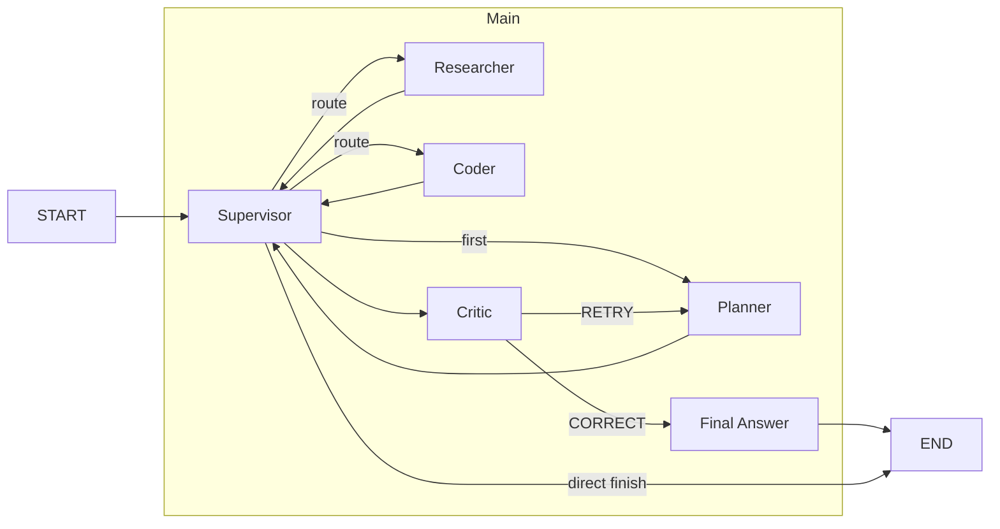

# GAIA Supervisor

A modular Supervisor-Planner-Worker-Critic architecture built with **LangGraph** and **LangChain** for the GAIA benchmark.

## 🏗 Architecture Overview

The system implements a sophisticated agent architecture that processes complex tasks through a structured workflow:

1. **Supervisor**: Coordinates the workflow, routes to appropriate nodes (Planner, Worker agents, Critic)
2. **Planner**: Creates a structured execution plan with specific steps before any tool execution
3. **Worker Agents**:
   - **Researcher**: Uses Tavily Search API to find information online
   - **Coder**: Executes Python code to solve computational tasks
4. **Critic**: Verifies final answers, ensures GAIA formatting compliance

The architecture includes automatic retries and fallback mechanisms to prevent infinite loops and recursion limits.



## ✨ Key Features

* **LangGraph StateGraph Architecture**: Maintains state across the entire workflow
* **Specialized Worker Agents**: Each with dedicated prompts and model configurations
* **GAIA Benchmark Integration**: Formats answers according to GAIA specifications
* **Gradio Web Interface**: For running evaluations and testing
* **Checkpoint System**: Provides persistence and fault tolerance
* **Multi-Model Support**: Works with OpenAI, Anthropic Claude, and Google Gemini models
* **Recursion Protection**: Built-in step counting and termination mechanisms

## 📋 Project Structure

```
gaia-supervisor/
├── src/
│   └── react_agent/               # Core source code
│       ├── __init__.py            # Module exports
│       ├── app.py                 # Gradio web interface & GAIA integration
│       ├── configuration.py       # Centralized config settings
│       ├── graph.py               # LangGraph builder and node definitions
│       ├── supervisor_node.py     # Supervisor implementation
│       ├── prompts.py             # System prompts for all agents
│       ├── state.py               # State definitions and constants
│       ├── tools.py               # Tool implementations
│       └── utils.py               # Helper functions
├── langgraph.json                 # LangGraph API server config
├── pyproject.toml                 # Project dependencies
├── requirements.txt               # Direct dependencies list
└── .env.example                   # Environment variable templates
```

## 🚀 Quick Start

### Prerequisites

- Python 3.11+ (3.12 recommended)
- API keys for: OpenAI, Anthropic, Google, Tavily, LangSmith (optional)

### Installation

1. **Clone the repository**
   ```bash
   git clone https://github.com/yourusername/gaia-supervisor.git
   cd gaia-supervisor
   ```

2. **Setup environment**
   ```bash
   # Create and activate a virtual environment
   python -m venv venv
   source venv/bin/activate  # On Windows: venv\Scripts\activate
   
   # Install dependencies
   pip install -e .
   ```

3. **Configure API keys**
   ```bash
   # Copy the example env file
   cp .env.example .env
   
   # Edit .env with your API keys
   ```

### Running the application

1. **Start the LangGraph server**
   ```bash
   langgraph dev
   ```

2. **Run the Gradio interface**
   ```bash
   python -m src.react_agent.app
   ```

## 📊 GAIA Benchmark Evaluation

The GAIA Benchmark integration provides:

1. **Question fetching**: Retrieves benchmark questions from the GAIA API
2. **Agent evaluation**: Processes questions through the agent architecture
3. **Answer submission**: Submits formatted answers to the GAIA leaderboard
4. **Score tracking**: Displays results with correct answers

The agent formats answers according to GAIA requirements:
- Numbers without units or commas
- Very concise responses
- No explanations or reasoning
- Specific formatting for lists and text

## 🔧 Configuration Options

Key settings in `configuration.py`:

| Setting | Description |
|---------|-------------|
| `model` | Default model for all agents |
| `*_model` | Specific models for each agent role |
| `recursion_limit` | Maximum recursion steps |
| `max_iterations` | Maximum planning iterations |
| `max_search_results` | Maximum web search results |

## 📝 License

MIT

---

**Built with [LangGraph](https://github.com/langchain-ai/langgraph)** - An open-source framework for building stateful, multi-actor applications with LLMs